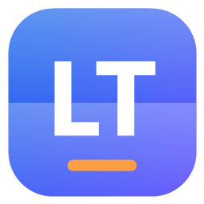
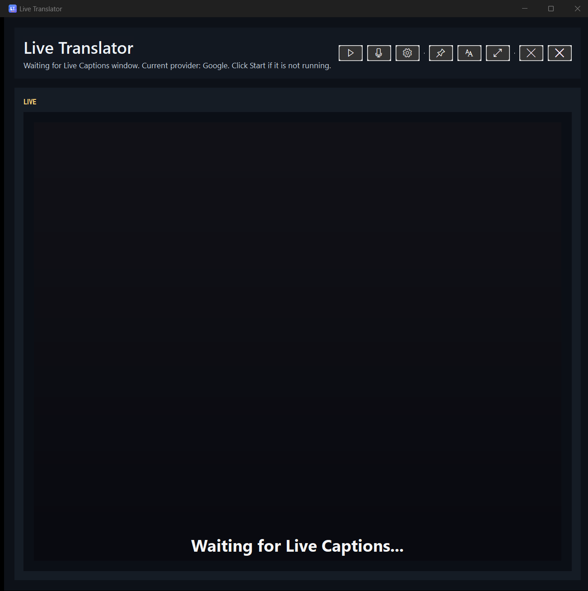
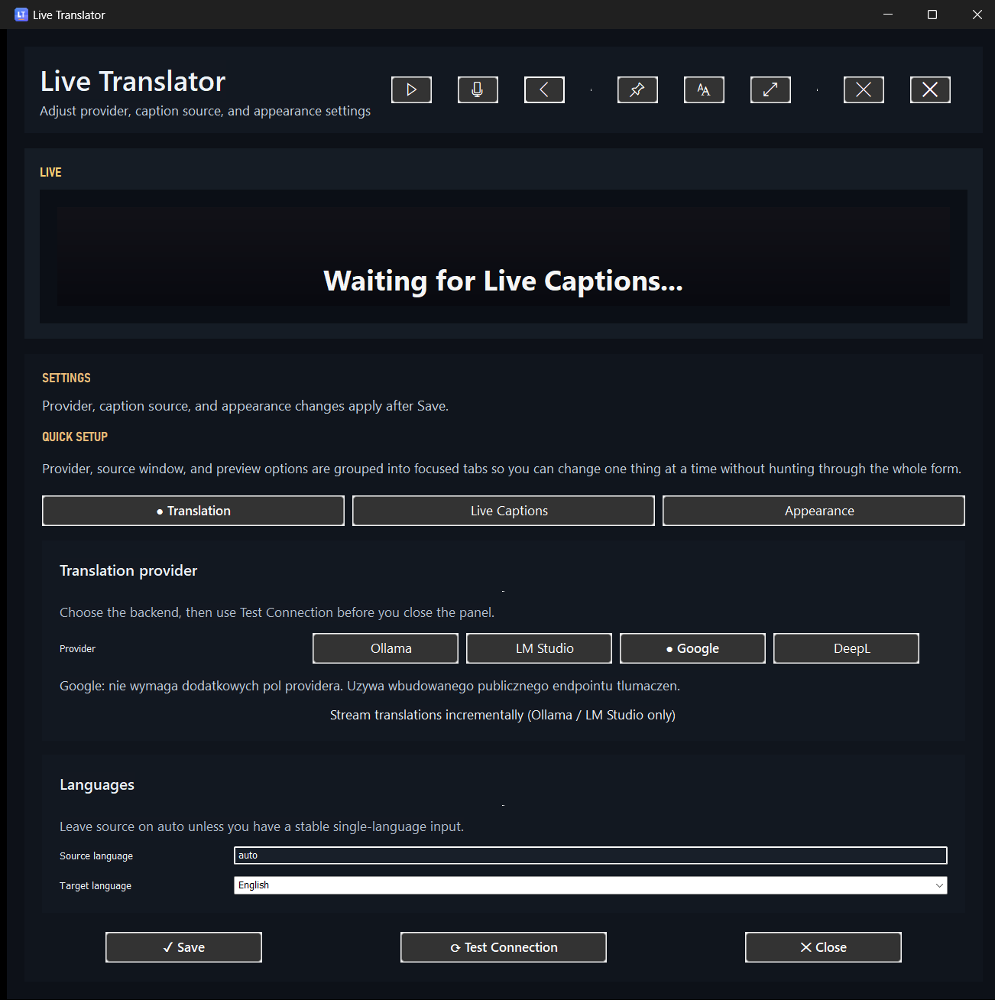
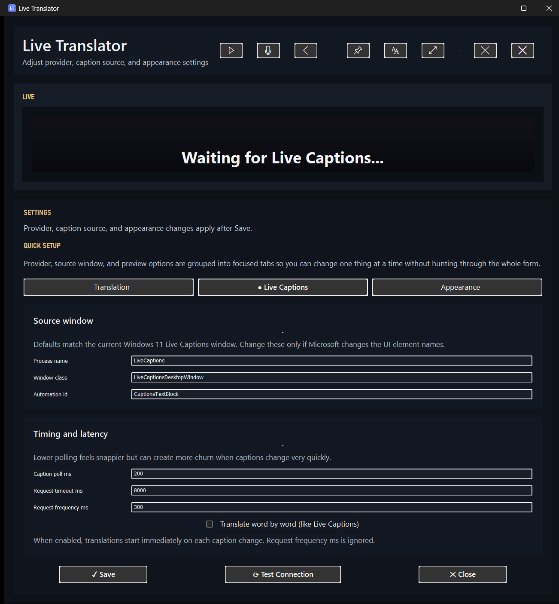
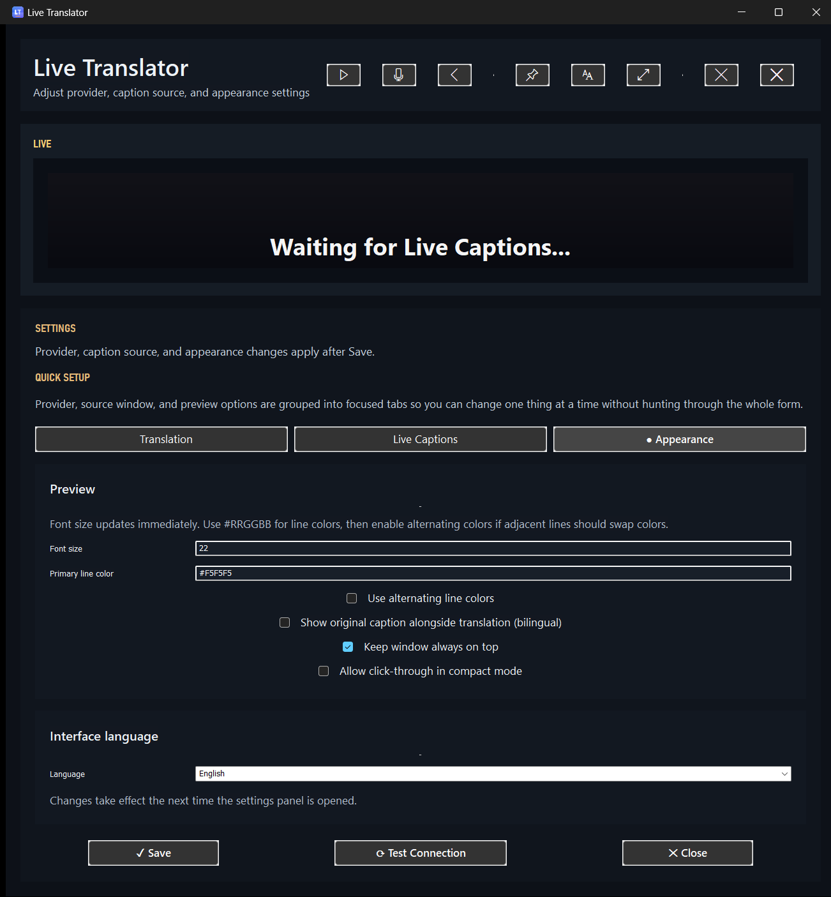

# Live Translator Go

<p align="center">
  
</p>

Simple Windows 11 desktop app that reads text from Windows Live Captions, translates it, and shows the result in the same window.

The flow is intentionally minimal:

`Windows Live Captions -> translation -> on-screen preview`

## Screenshots

| Main window | Settings - Translation |
| :---: | :---: |
|  |  |
| Dark preview with icon toolbar: start captions, open speech panel, toggle settings, pin on top, font, focus mode, clear, close. | Pick provider (Ollama / LM Studio / Google / DeepL), run `Test Connection`, optionally toggle streaming for LLM providers. |

| Settings - Live Captions | Settings - Appearance |
| :---: | :---: |
|  |  |
| Source window bindings for Windows 11 Live Captions, polling / timeout / frequency, optional word-by-word mode. | Font size, line colors (with alternating lines), bilingual dual-line mode, always-on-top, click-through, and UI language (PL/EN). |

## What It Is For

This project is for people who want fast translated captions from Windows Live Captions without building a separate ASR pipeline, backend service, or browser app.

Typical use cases:

- translating live speech during meetings, videos, and presentations,
- testing local providers such as Ollama or LM Studio,
- keeping captions and translated output in one desktop window,
- using a small local tool with minimal setup and no extra database.

## KISS Scope

This project is meant to stay close to KISS. The current version follows a few strict rules:

- one main GUI window,
- one transcription source: Windows Live Captions,
- one local settings file: `setting.json`,
- only four providers: Google, DeepL, Ollama, and LM Studio,
- no history database, installer, or background service.

## What The Program Does

- reads text from the system Live Captions window through Windows UI Automation,
- sends text to the selected translation provider,
- shows the result in a dark preview window,
- supports bilingual dual-line output (original + translation) when enabled,
- streams partial translations for Ollama / LM Studio (chat-completions SSE),
- lets you pin glossary terms that are injected into the LLM system prompt,
- persists window placement across runs (DPI-aware, 96-dpi units),
- lets you switch UI language between Polish and English,
- saves local settings to `setting.json`.

## What It Does Not Do

- it does not implement its own speech-to-text engine,
- it does not require a backend server,
- it does not keep translation history in a database,
- it does not try to be a full subtitle suite.

## Requirements

- Windows 11 with Windows Live Captions available,
- Go 1.25+ if you want to run from source,
- provider configuration only if you are not using Google.

## Quick Start

Run from the project directory:

```powershell
go run ./cmd/live-translator-go
```

If Live Captions is not enabled yet, start it in Windows and wait for the app to attach to the window.

Google works out of the box. For other providers, configure the values in `Settings`.

Example for Ollama:

```powershell
$env:LIVE_TRANSLATOR_PROVIDER = "Ollama"
$env:LIVE_TRANSLATOR_BASE_URL = "http://localhost:11434/v1"
$env:LIVE_TRANSLATOR_MODEL = "llama3.1:8b"
$env:LIVE_TRANSLATOR_TRANSLATION_CONTEXT = "Technical meeting about backend APIs and Kubernetes."
go run ./cmd/live-translator-go
```

## Build

Desktop build without a visible console window:

```powershell
go build -ldflags="-H windowsgui" ./cmd/live-translator-go
```

## Portable EXE Build

The repository includes a GitHub Actions workflow that builds a single portable `.exe` file.

What the workflow does:

- embeds the Windows manifest and app icon into the executable,
- builds one standalone `live-translator-go.exe`,
- uploads the `.exe` as a workflow artifact,
- attaches the raw `.exe` to GitHub Releases for tags matching `v*`.

That means the release output is one file only: `live-translator-go.exe`.
No installer is required.

The app will create `setting.json` on first run when needed, so the executable is the only file that needs to be distributed.

If you want to build the same portable executable locally:

```powershell
./scripts/build-release.ps1
```

Regenerate the app icon from source (renders `assets/app.ico` + `assets/app.png` + the embed copy under `internal/ui/appicon/`):

```powershell
./scripts/generate-icon.ps1
```

Capture a fresh screenshot of the running app (uses `PrintWindow`, so the window does not need to be foreground):

```powershell
./scripts/capture-screenshot.ps1 -OutputPath .\docs\screenshots\main-window.png
```

## Project Structure

- `cmd/live-translator-go` - application entry point,
- `internal/captions` - Live Captions text capture,
- `internal/translator` - translation providers (Google, DeepL, chat-completions with streaming and glossary),
- `internal/pipeline` - input coalescing and processing,
- `internal/overlay` - main window and preview (DPI-aware window bounds persistence),
- `internal/app` - app wiring and settings flow,
- `internal/ui/appicon` - embedded application icon used at runtime,
- `internal/i18n` - Polish / English UI strings,
- `assets/` - app icon (`app.ico`, `app.png`),
- `docs/screenshots/` - screenshots used in this README,
- `scripts/build-release.ps1` - local and CI build for the standalone Windows executable,
- `scripts/generate-icon.ps1` - regenerate the multi-resolution icon,
- `scripts/capture-screenshot.ps1` - capture a screenshot of the running app,
- `setting.json` - local runtime settings, intentionally not committed.

## Release Flow

To publish a downloadable `.exe` through GitHub Actions:

1. Push commits to `main` to validate the Windows build in CI.
2. Create and push a tag such as `v0.1.0`.
3. GitHub Actions will build the app and attach `live-translator-go.exe` directly to the release.

## License

This project is released under GPL-3. See `LICENSE`.
